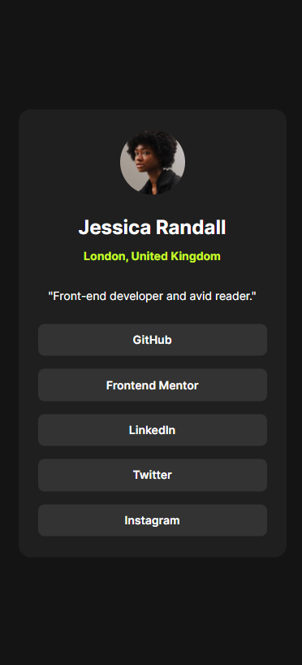
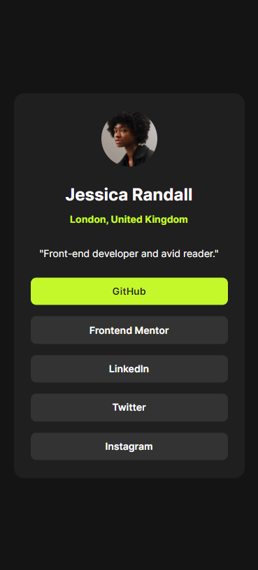

# Frontend Mentor - Social links profile

This is a solution to the [Social links profile challenge on Frontend Mentor](https://www.frontendmentor.io/challenges/social-links-profile-UG32l9m6dQ).
Frontend Mentor challenges help you improve your coding skills by building realistic projects. 

## Table of contents

- [Overview](#overview)
  - [Screenshot](#screenshot)
  - [Links](#links)
- [My process](#my-process)
  - [Built with](#built-with)
- [Author](#author)

## Overview

### Screenshots

 This is the desktop view.

 This is the mobile view.

 This is the hover effect that a user could see when the pointer of the mouse is on a link.

### Links

- Solution URL: [https://github.com/totarochristian/social-links-profile](https://github.com/totarochristian/social-links-profile)
- Live Site URL: [https://social-links-profile-kappa-nine.vercel.app/](https://social-links-profile-kappa-nine.vercel.app/)

## My process

### Built with

- Semantic HTML5 markup
- CSS custom properties

## Author

- GitHub - [@totarochristian](https://github.com/totarochristian)
- Frontend Mentor - [@totarochristian](https://www.frontendmentor.io/profile/totarochristian)
- Linkedin [Christian Totaro](https://www.linkedin.com/in/christian-totaro-080a7018a/)